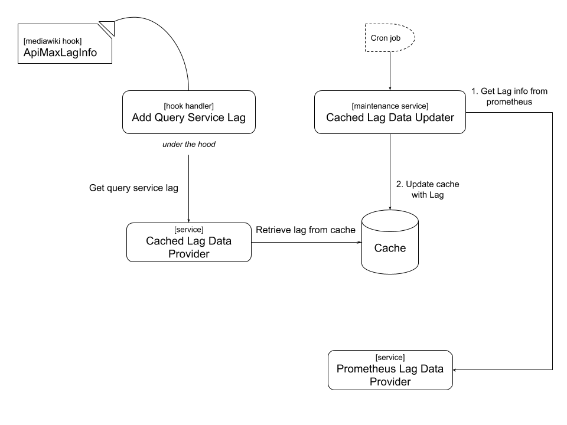

001 - Including query service lag in Maxlaginfo
=============================================

## Status

Approved

## Context

Due to WDQS having a lag on catching up with edits to Wikidata, and that lag being affected
by the size of the entities being edited not just the rate of those edits, high volume edits can
create strain on WDQS due to update processing of the dispatched update jobs,
more than WDQS update capacity can handle in a timely manner, resulting in sluggish WDQS.

Example incident can be found here:
https://www.wikidata.org/w/index.php?title=Wikidata:Administrators%27_noticeboard&oldid=963260218#Edoderoobot_edit_rate

## Decision

As part of [T221774](https://phabricator.wikimedia.org/T221774), we want to
retrieve WDQS lag, from relevant clusters, and add it to maxlag logic provided
by mediawiki, in order to block edits when WDQS is lagging too much.

We also decided that querying the relevant WDQS endpoints lag should happen
asynchronously, with lag info being cached with a reasonable ttl. That cached
lag information then can be accessed, in a hook handler for
[ApiMaxLagInfo](https://www.mediawiki.org/wiki/Manual:Hooks/ApiMaxLagInfo)
that will update lag info when they are available.

The following visual diagram shows the elements of the design
on conceptual level:

